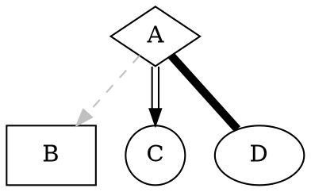

# Graphviz 

[Graphviz](https://graphviz.gitlab.io) stands for graph visualization software. Graphs are created by describing them in a specifically created language: [dot](https://graphviz.gitlab.io/_pages/doc/info/lang.html).

## Examples

### Shapes

