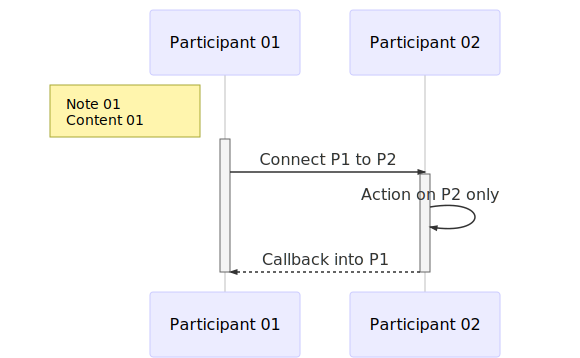

# Mermaid

[Mermaid](https://mermaidjs.github.io/) allow generation of diagrams and flowcharts from text in a similar manner as markdown.

## Conversion Tool (mermaid.cli)

```sh
# Install
npm install -g mermaid.cli

# Convert to SVG
mmdc -i input.mmd -o output.svg

# Convert to PNG
mmdc -i input.mmd -o output.png
```

## Diagram Example 

### Sequence Diagram 

```mmd
sequenceDiagram

    participant p1 as Participant 01
    participant p2 as Participant 02

    Note left of p1: Note 01<br/>Content 01
    activate p1
    p1->>p2: Connect P1 to P2
    activate p2
    p2->p2: Action on P2 only
    p2-->>p1: Callback into P1
    deactivate p2
    deactivate p1
```



