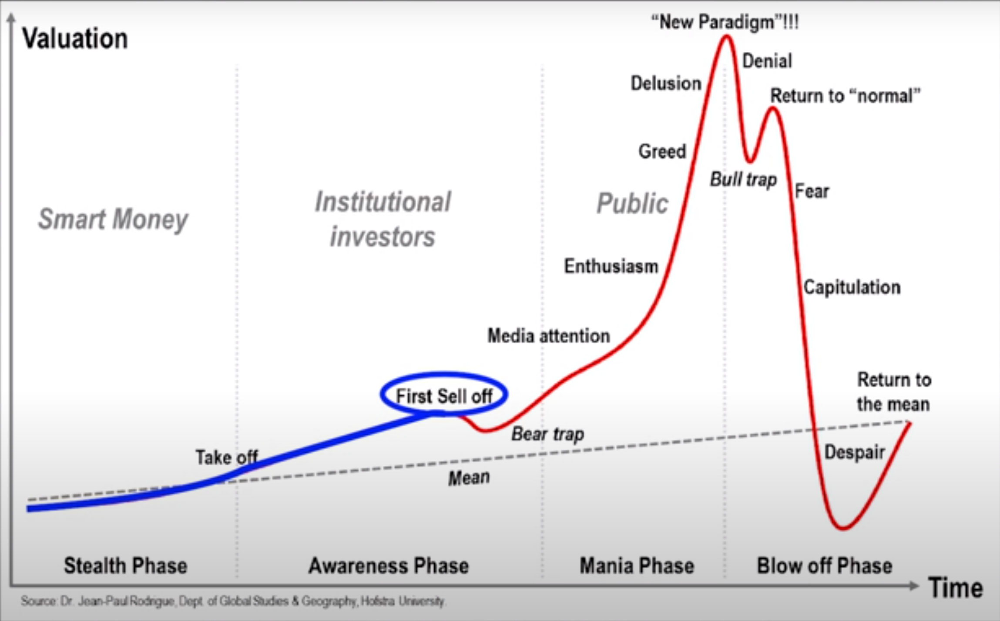

# Stock Indicators

## MACD (Moving Average Convergence Divergence)

Moving average convergence divergence (MACD) is a trend-following momentum indicator that shows the relationship between two moving averages of prices. The MACD is calculated by subtracting the 26-day exponential moving average (EMA) from the 12-day EMA. A nine-day EMA of the MACD, called the "signal line", is then plotted on top of the MACD, functioning as a trigger for buy and sell signals.

1. Crossovers - As shown in the chart above, when the MACD falls below the signal line, it is a bearish signal, which indicates that it may be time to sell. Conversely, when the MACD rises above the signal line, the indicator gives a bullish signal, which suggests that the price of the asset is likely to experience upward momentum. Many traders wait for a confirmed cross above the signal line before entering into a position to avoid getting "faked out" or entering into a position too early, as shown by the first arrow.

2. Divergence - When the security price diverges from the MACD, it signals the end of the current trend. For example, a stock price that is rising and a MACD indicator that is falling could mean that the rally is about to end. Conversely, if a stock price is falling and the MACD is rising, it could mean that a bullish reversal could occur in the near-term. Traders often use divergence in conjunction with other technical indicators to find opportunities.

### MACD Actions summary

| Info                                         | Meaning                          | Action         |
|----------------------------------------------|----------------------------------|----------------|
| Timeframe for analysis                       | 1 month                          |                |
| 26 days (Orange) crossed up 12 days (Blue)   | Bullish Trend                    | Signal to Buy  |
| 26 days (Orange) crossed down 12 days (Blue) | Bearhish Trend                   | Signal to Sell |
| MACD is falling and Stock Price is raizing   | Bullish Trend is finishing       | Stop Buying    |
| MACD is raizing and Stock Price is falling   | Bearhish Trend is finishing      | Stop Selling   |
| Difference is negative big                   | Price is going up (Oversold)     |                |
| Difference is positive big                   | Price is going down (Overbought) |                |
| Derivate is 0 and diference was going down   | Price is going up                |                |
| Derivate is 0 and diference was going up     | Price is going down              |                |

## Structure of a Buble

