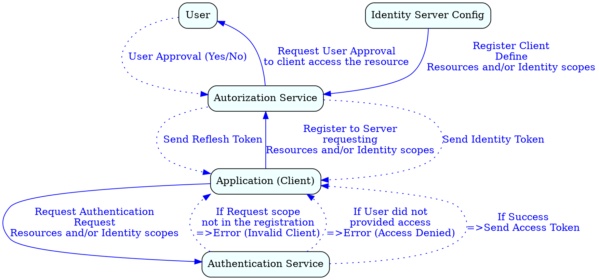
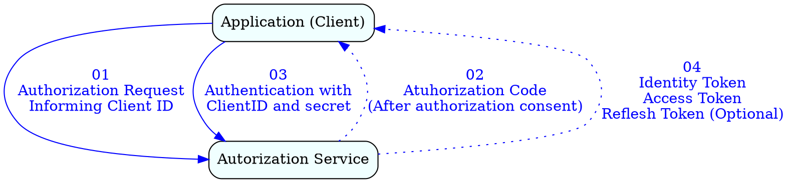
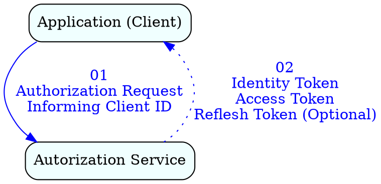
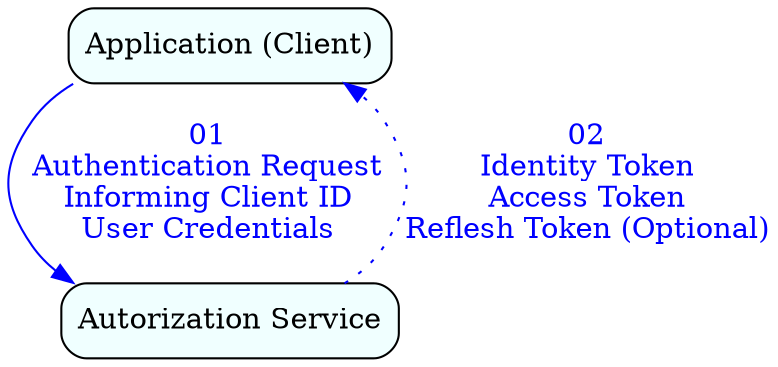
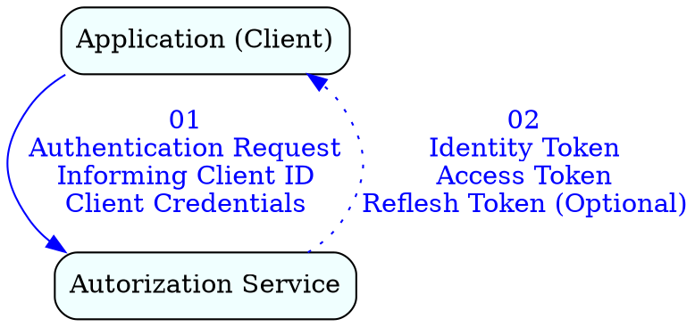

# IdentityServer

[IdentityServer](https://identityserver.github.io/Documentation/) is a framework and a hostable component that allows implementing single sign-on and access control for modern web applications and APIs using protocols like OpenID Connect and OAuth2. It supports a wide range of clients like mobile, web, SPAs and desktop applications and is extensible to allow integration in new and existing architectures.

## OpenID Connect 

**Authentication** is different of **Authorization**.

- *Authentication*: Validates a claimed identity 
- *Authorization*: Controls access of an identity to resources. 

OpenID Connect provides both authentication and authorization in one protocol by layering authentication on top of the [OAuth2](https://oauth.net/2/) authorization protocols. Both protocols uses HTTP and JSON.

### Tokens Types

- Identity Token: Impersonate a successfull user. *Identity token* is issue to the *client* by an *Authorization Server* and must be validated by the *client*. Any request that send a *valid token* will be accepted, therefore the channed to where the *token* is transmitted should be secure (using TLS/SSL) so a *main in the middle attack* cannot intercept the *token* being sent.

- Access Token: Credential used to access protected resources. It contains specific scope and durations of access. Access tokens may be either a JWT (JSON Web Token) or a reference token, which is an identifier for the actual token held in the authorization server.

- Reflesh Token: Credential used to obtain *Access Tokens*. When the current *Access Token* expire, the *Client* can use the *Reflesh Token* to get a new *Access Token*. *Reflesh Tokens* also contains a lifetime (Default is usually 30 days). Once it is expired, there is not way to the *Client* to get another *Token* but authenticate again. If the *Reflesh token* is provided with a **sliding reflesh expire date (Default 15 days)**, each time the *token* is used, its *sliding* information is replaced with another one. In this way if the tokens is always used within the *sliding period*, it will never expire.

### Scopes

Scopes are identifiers for resources that a client wants to access. When a client request a *token* to the *identity Server*, it should include in the request the list of *scopes* that it want to have access to.

There are 02 types of *scopes*:

- Resource Scopes: Define access to *resources* (E.g.: read database, write file, etc.)
- Identity Scopes: Define access to the *Identity Information (E.g.: adminitrator user, anonymous user, etc.). With this *scope* granted, a *client* can access the information of the *Identity* (E.g.: e-mail, name, phone, etc.)

### Workflow

- Each *client* registered has an unique *client id*
- *Clients* can authenticate themselves using *secrets* or *certificates* (In this case, the [*certificate thumbprint*](https://docs.microsoft.com/en-us/dotnet/framework/wcf/feature-details/how-to-retrieve-the-thumbprint-of-a-certificate) is used as secret)
- The *User* consent form can be configure to be displayed or not.
- After *authentication*, the *token* returned can be either JWT (JSON Web Token) or a reference token. If a *reference token* is returned, the *client* has to validate it with the *Authorization Server*. If JWT is returned, it is not required an additional call to the *Authorization Server*.

#### Authorization Code Flow (Uses Front channel + Back channel)

Most suitable for *server-side clients* where the *client* can *securely maintain a secret*

#### Implicit Flow (Uses Front channel only)

Most suitable for *browser based clients* which cannot sensibly maintain a client secret and cannot therefore authenticate themselves with the *authorization server*

Because an *authenticated session* exists between the *browser* and the *authorization server* it is possible to resubmit the *authentication request* and receive a new set of *tokens* when the current *access token* expires.

#### Hybrid Flow

Most suitable for native and mobile apps. It is best used combined with [PKCE, (Proof Key for Code Exchange)](https://oauth.net/2/pkce/), which ensures that another client cannot use the Code to request tokens. 

#### Resource Owner (Credentials) Flow (Uses Back channel only)

Used in highly trusted applications if the password is stored

A *reflesh token* cannot be requested, the client must re-authenticate itself and request another access token when necessary

#### Client Credentials Flow (Uses Back channel only)

Used for highly trusted clients when no other flow can be used.

A *reflesh token* cannot be requested, the client must re-authenticate itself and request another access token when necessary

### Single Sign On 

On *Single Sign On*, the user authenticated with an *authorization server* is not requested to enter the credentials when running another application that connects to the same *authorization server*. 

## Identity Server .Net Core

It will have 02 parts to use the *Identity Server Framework*:

1- Server: *ASP.NET* application that implements the interface of the supported protocols (OAuth2) using a *middleware*.

2- Client: *ASP.NET* application that will talk to the *Server* requesting authorization and validation

In order to provide the proper user access to the *Client*, you have to inform (configure) the *Server* about the *User* and the *Application*.

## Jargons

- Resource Owner: User that is using the service. The user owns the data.

- Client: Application the uses the resources.

- Authorization Server: Is the software that authorize the access to the resource (E.g.: google.com/accounts)

- Resource Server: Is the software system that holds the resources (E.g.: Blob service, docker registry, etc)

- Authorization grant: Is the "token" that inform that the users pressed "Yes" when requested for authorization. 

- Redirect URI: Is the callback URL that will be called after the OAuth2 flow.

- Access token: Token that allow the client to have access to the resource.

- Scope: Define the level of permission that is used to access the resources. 

- Back channel: Highly secure channel (E.g.: service communication same machine)

- Front channel: Less secure channel (E.g.: browser)

### OAuth2 authorization code flow

#### Authorization code flow 

### OpenId Connect (OIDC)

It is basically OAuth2 with extensibility to also request an ID token (JWT)

## How-to 

## Examples

- [Identity Server Client](https://github.com/RogerioDosSantos/example_dotnet_identity_server_client)

## References

- [OAuth 2.0 and OpenID Connect (in plain English) Video](https://www.youtube.com/watch?v=996OiexHze0)
- [IdentityServer3 Example](https://github.com/IdentityServer/IdentityServer3.Samples.git)
- [Introduction to IdentityServer for ASP.NET core](https://www.youtube.com/watch?v=J5p72gTdx_M)
- [Azure Identity](https://docs.microsoft.com/en-us/azure/security/azure-security-identity-management-best-practices)
- [angular-oauth2-oidc - Support for OAuth 2 and OpenId Connect (OIDC) in Angular](https://github.com/manfredsteyer/angular-oauth2-oidc)
- [OAuth2 Debbugger](https://oauthdebugger.com/)
- [OpenID Connect Debbuger](https://oidcdebugger.com/)
- [Azure Managed Service Identity And Local Development](https://www.rahulpnath.com/blog/azure-managed-service-identity-and-local-development/)
- [Authenticating with Azure Key Vault Using Managed Service Identity](https://www.rahulpnath.com/blog/authenticating-with-azure-key-vault-using-managed-service-identity/)
- [DefaultAzureCredential Class](https://learn.microsoft.com/en-us/dotnet/api/azure.identity.defaultazurecredential?view=azure-dotnet)
- [Microsoft identity platform - Web API documentation](https://docs.microsoft.com/en-us/azure/active-directory/develop/index-web-api?view=aspnetcore-6.0)
- [Microsoft identity platform - Scenario: Desktop app that calls web APIs](https://docs.microsoft.com/en-us/azure/active-directory/develop/scenario-desktop-overview)
- [Microsoft identity platform - Scenario: Protected web API](https://docs.microsoft.com/en-us/azure/active-directory/develop/scenario-desktop-overview)
- [Microsoft Identity Platform Guide - Video](https://www.youtube.com/watch?v=LRoc-na27l0)
- [Secure a .NET Core API with Bearer Authentication](https://www.youtube.com/watch?v=3PyUjOmuFic)
- [Video - C# with CSharpFritz - S2 E7 - Introducing Authentication and Authorization with ASP.NET Core](https://www.youtube.com/watch?v=u898_hiWJY0)
- [Video - Application roles and security groups on the Microsoft Azure identity platform (Azure Active Directory (AAD))](https://www.youtube.com/watch?v=-BK2iBDrmNo)
- [Video - JWT (JSON Web Token) ASP.NET Core 3.1 Web API Authentication with private public Certificate](https://www.youtube.com/watch?v=08Qq4BDBVkg)

