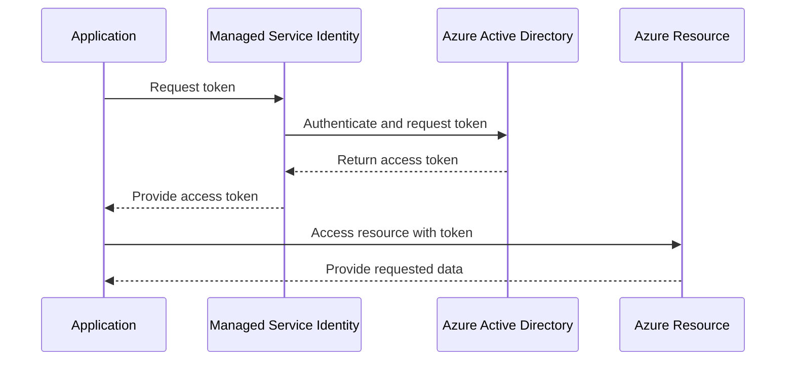

# Managed Service Identity (MSI)

Managed Service Identity (MSI) is an Azure feature that provides automatic identity management for applications running in Azure. It enables services to securely access Azure resources without storing credentials in code.

## Key Features
- Automatic identity provisioning for Azure resources
- Secure access to Azure Key Vault, Storage, and other services
- No need to manage credentials or secrets
- Supports both system-assigned and user-assigned identities
- Integrated with Azure Active Directory

## How It Works

When an Azure resource with MSI enabled is created, Azure automatically provisions an identity in Azure Active Directory. This identity can then be granted permissions to access other Azure resources. Applications can use this identity to authenticate and access resources securely.

## Setting Up MSI

1. **Enable MSI**: Enable Managed Identity for your Azure resource (e.g., Virtual Machine, App Service) through the Azure portal, CLI, or ARM templates.
1. **Assign Roles**: Assign appropriate roles to the MSI in Azure Active Directory to grant access to required resources.
1. **Use MSI in Code**: Modify your application code to use the MSI for authentication. Azure SDKs provide built-in support for MSI.
1. **Access Resources**: Use the MSI to access Azure resources securely without embedding credentials.

**Important**: 

The *MSI* should be associated in the resource that will use it to connect to another resource.

On the resource that will be accessed, you grant access to it by assigning the appropriate role to the *MSI*.

As for example, if you have a Virtual Machine that needs to access an Azure Storage account, you would:
1. Enable MSI on the Virtual Machine.
1. Assign the "Storage Blob Data Contributor" role to the Virtual Machine's MSI on the Azure Storage account.

**Do not associate the MSI in any other place than the resource that will use it.**

## Useful Links
- [Azure Managed Identities Documentation](https://learn.microsoft.com/en-us/azure/active-directory/managed-identities-azure-resources/overview)
- [Best practices for Managed Identities](https://learn.microsoft.com/en-us/azure/active-directory/managed-identities-azure-resources/best-practices)

