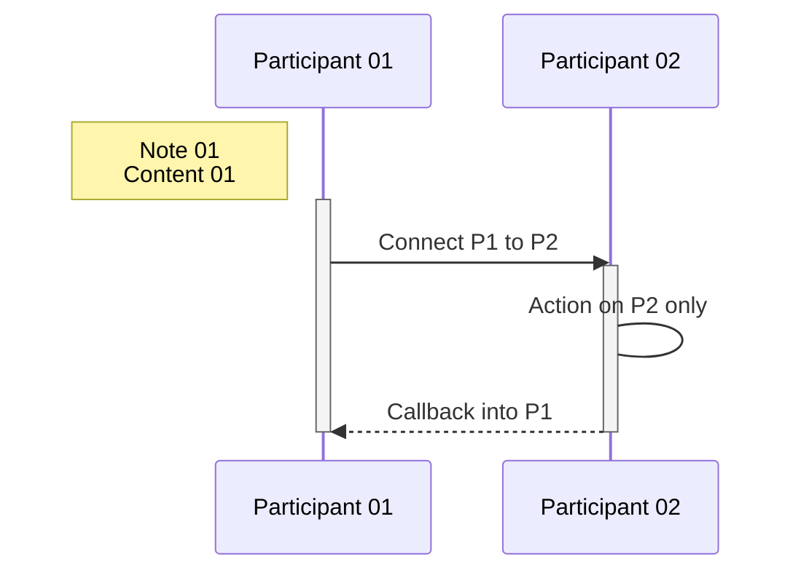
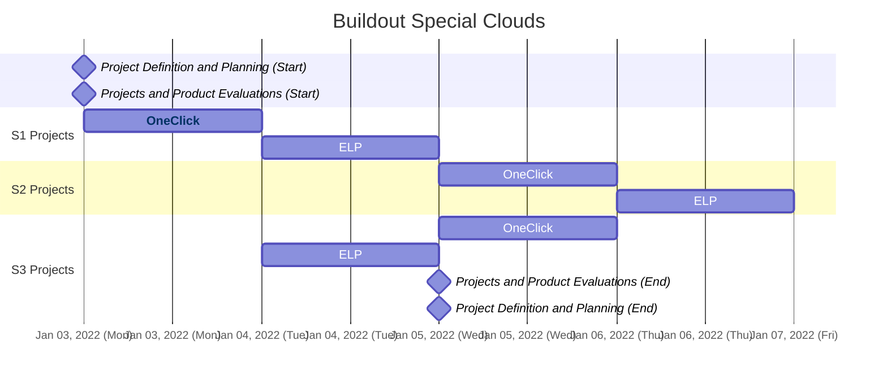

# Mermaid Diagrams and Flowcharts

Mermaid allows generation of diagrams and flowcharts from text, similar to Markdown. This document provides guidance on using Mermaid, including installation, usage, and integration with Azure DevOps Wikis.

---

## Table of Contents

- [Overview](#overview)
- [Installation and Conversion](#installation-and-conversion)
- [Using Mermaid in Azure DevOps Wikis](#using-mermaid-in-azure-devops-wikis)
- [Diagram Examples](#diagram-examples)
  - [Sequence Diagram](#sequence-diagram)
  - [Gantt Chart](#gantt-chart)
- [References](#references)

---

## Overview

**Mermaid** is a tool for creating diagrams and flowcharts from plain text. It is especially useful for:

- Visualizing workflows and processes
- Embedding diagrams in Markdown documentation
- Automating diagram generation in CI/CD pipelines

> 📌 **Tip**: Mermaid diagrams can be rendered directly in supported Markdown editors and platforms.

---

## Installation and Conversion

**Install Mermaid CLI:**

To install the Mermaid CLI globally using npm:

```sh
# Install Mermaid CLI globally
npm install -g mermaid.cli
```

**Convert Mermaid files to images:**

To convert a `.mmd` file to SVG:

```sh
# Convert Mermaid file to SVG
mmdc -i input.mmd -o output.svg
```

To convert a `.mmd` file to PNG:

```sh
# Convert Mermaid file to PNG
mmdc -i input.mmd -o output.png
```

---

## Using Mermaid in Azure DevOps Wikis

You can add Mermaid diagrams to an Azure DevOps wiki page using the following syntax:

```markdown
::: mermaid
<mermaid diagram syntax>
:::
```

> 💡 **Note**: Not all platforms support Mermaid syntax natively. Check your documentation tool's compatibility.

---

## Diagram Examples

### Sequence Diagram

The following example demonstrates a simple sequence diagram:

```mmd
sequenceDiagram

    participant p1 as Participant 01
    participant p2 as Participant 02

    Note left of p1: Note 01<br/>Content 01
    activate p1
    p1->>p2: Connect P1 to P2
    activate p2
    p2->p2: Action on P2 only
    p2-->>p1: Callback into P1
    deactivate p2
    deactivate p1
```

Results:

---

### Gantt Chart

This example shows a Gantt chart for project planning:

```mmd
gantt
dateFormat  YY-MM-DD
axisFormat  %b %d, %Y (%a)
excludes    weekends

title Buildout Special Clouds

Project Definition and Planning (Start): milestone, m_definition_start, 22-01-03, 0d

Projects and Product Evaluations (Start): milestone, m_evaluation_start, after m_definition_start, 0d

section S1 Projects
OneClick:  t_evaluation_p1, after m_evaluation_start, 1d
ELP:       t_evaluation_p2, after t_evaluation_p1, 1d

section S2 Projects
OneClick:  t_evaluation_p3, after t_evaluation_p2, 1d
ELP:       t_evaluation_p4, after t_evaluation_p3, 1d

section S3 Projects
OneClick:  t_evaluation_p5, after t_evaluation_p2, 1d
ELP:       t_evaluation_p6, after t_evaluation_p1, 1d


Projects and Product Evaluations (End): milestone, m_evaluation_end, after t_evaluation_p6, 0d

Project Definition and Planning (End): milestone, m_definition_end, after m_evaluation_end, 0d

click t_evaluation_p1 href "https://mermaidjs.github.io/"
```

Results:


---

## References

| Resource | Description |
|----------|-------------|
| [Mermaid Online Tool](https://mermaid.live) | Live editor for Mermaid diagrams |
| [Mermaid Documentation](https://mermaid-js.github.io/mermaid/#/n00b-gettingStarted) | Official documentation |
| [Azure DevOps Wiki Markdown Guidance](https://docs.microsoft.com/en-us/azure/devops/project/wiki/wiki-markdown-guidance) | Markdown syntax for Azure DevOps Wiki |

---
