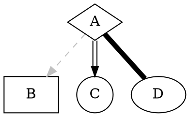

# Graphviz 

[Graphviz](https://graphviz.gitlab.io) stands for graph visualization software. Graphs are created by describing them in a specifically created language: [dot](https://graphviz.gitlab.io/_pages/doc/info/lang.html).

## How-to

### Graphviz - Compile

```shell
# dot >> png
cat ./file.dot | dot -Tpng > ./file.png

# dot >> svg
cat ./file.dot | dot -Tsvg > ./file.svg

# dot >> pdf
cat ./file.dot | dot -Tpdf > ./file.pdf

# dot >> svg (Not showing unconnected nodes (nodes without edges))
gvpr -c "N[$.degree==0]{delete(root, $)}" ./file.dot | dot -Tsvg > ./file.svg

# dot >> svg (including files using M4 macros)
m4 ./file.dot | dot -Tsvg > ./file.svg
```

### Shapes



